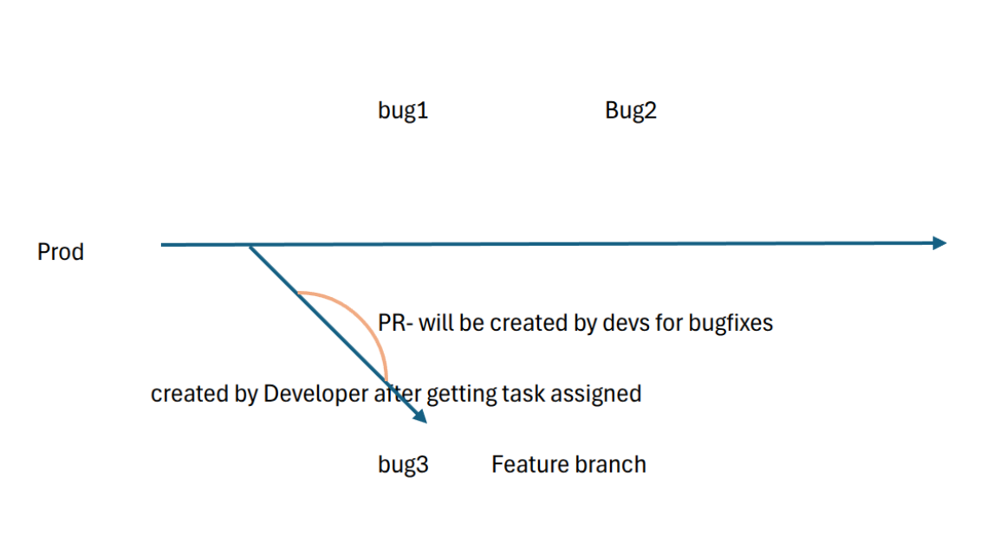
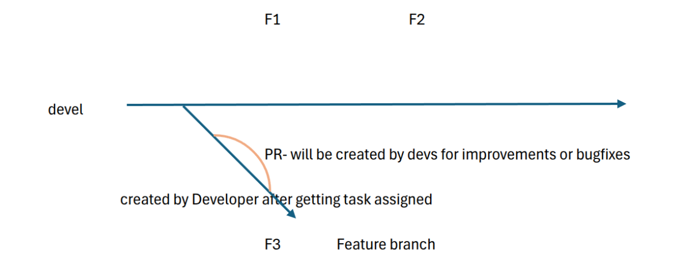

Nexus Book: The Systems Team Process
====================================

Introduction
------------

This book defines the essential processes, tools, and best practices that empower teams to collaborate seamlessly, drive efficiency, and scale with confidence. This book is designed to:

- **Standardize Processes:** Define clear workflows for each squad to ensure consistency.
- **Improve Collaboration:** Highlight inter-team dependencies and best practices for smooth integration.
- **Enhance Knowledge Sharing:** Provide in-depth technical and process documentation for current and future team members.
- **Optimize Performance:** Define measurable KPIs and continuous improvement strategies.

Whether you're an existing team member or a **Fresher to Systems Team**, this book will help you navigate the **System Excellence framework** and contribute effectively.

SB- Systems Architecture Overview
---------------------------------

.. image:: _static/systems_team_overview.png
   :alt: Systems Team Overview
   :align: center

.. raw:: html

      

Customers will raise queries and report issues encountered during daily product usage. These requests are directed to either the **Glory team** or **Field Engineers** through issue tickets in **Azure**, as detailed in this document.

Once a ticket is raised, the **Support Team** will review and categorize it into appropriate task types, such as **issues/cases**, **bugs**, or **feature requests**, ensuring a structured approach to resolution.

The **Support Team** will handle and resolve general **issues/cases**. However, **bugs** and **feature requests** will be escalated by creating tickets for the **Development Team**, ensuring they are addressed systematically and integrated into the development pipeline.

The **Development Team** will work on fixing reported **bugs**, updating the **software**, and implementing **new features**. Once the development is complete, the updated software will be sent to the **QA Team** for thorough testing to ensure functionality, stability, and compliance with requirements.

Once the **QA Team** has tested and validated the updates, the release will be handed over to the **RTE (Release Train Engineer)**, who will ensure proper alignment and readiness for deployment.

If any issues/cases are identified during this stage, the changes will go through the necessary iteration loop for fixes and retesting. Once cleared, the final release will be deployed by the **ROPS Team** or **Field Engineers**, ensuring a smooth rollout to production.

All necessary process documents detailing this overall flow are provided below. These documents explain:

- **Why** each process is necessary
- **How** each process is executed
- **Which tools** are used to achieve seamless implementation

Here's a refined, structured guide integrating your notes into a comprehensive **L2 to Dev Team Process Flow:** 

L2 to Dev Team Process Guide
============================

This guide outlines the structured flow of issues/cases from the **L2 support team** to the **development team**, ensuring smooth handling, tracking, and resolution.

Issue/Cases Identification & Categorization
-------------------------------------------

L2 support receives issues/cases from L1, monitoring systems, Glory Team or directly from customer. L2 debugging begins with checking logs, assessing system health, and reviewing previous occurrences to identify patterns or recurring issues. If the problem aligns with known resolutions, L2 applies quick fixes such as restarting services, adjusting configurations, or updating database entries. However, if the issue requires code changes or deeper investigation, it is escalated to the development team. Before escalation, L2 ensures that all necessary details, including logs, steps to reproduce, and environmental information, are thoroughly documented in Azure tickets to facilitate efficient troubleshooting by the developers. 

Issue/Cases Analysis Guide Docs:
--------------------------------
- `Cases Handling Handbook - US.docx <https://gajanrapyutarobotics.sharepoint.com/:w:/r/sites/04_chennai/Shared%20Documents/01_onboarding/SB_Systems_Docs/Cases%20Handling%20Handbook%20-%20US.docx?d=w9e84adfb07b54685b59c98310bb4aba4&csf=1&web=1&e=ZqRm3q>`_
- `Issue Handling Handbook_v1.0.docx <https://gajanrapyutarobotics.sharepoint.com/:w:/r/sites/04_chennai/Shared%20Documents/01_onboarding/SB_Systems_Docs/Issue%20Handling%20Handbook_v1.0.docx?d=wf8e2d27a4a3b454db3bb7e5eb1edf67b&csf=1&web=1&e=oa9nAA>`_
- `U.S CASES CHECKLIST.docx <https://gajanrapyutarobotics.sharepoint.com/:w:/r/sites/04_chennai/Shared%20Documents/01_onboarding/SB_Systems_Docs/U.S%20CASES%20CHECKLIST.docx?d=wa5700ab88f77446fb40382d2d7438663&csf=1&web=1&e=Iq5tcO>`_

The issue/cases are then categorized into: 

- **Bugs -** Functional defects requiring code fixes. 
- **Feature Requests -** New functionalities requested by users or stakeholders. 
- **Improvements -** Configuration changes or optimizations to enhance velocity, productivity, or product stability. 

Issue/Case Routing & Documentation
----------------------------------

Each category follows a distinct workflow:

**Bugs (From Reporting to Completion)**
~~~~~~~~~~~~~~~~~~~~~~~~~~~~~~~~~~~~~~~

When L2 identifies a bug, they log it in the tracking system (Azure) with a detailed issue description, steps to reproduce, relevant logs, screenshots, and environment details to ensure clarity for the development team. Once reported, the RTE evaluates its priority—categorizing it as critical, major, or minor—before scheduling it in an upcoming sprint based on its impact. Assigned developers then begin investigating and resolving the bug, ensuring the fix undergoes thorough peer review and testing before deployment. Once the fix is integrated into the release pipeline, L2 performs final validation to confirm that the issue is resolved before marking it as closed.

**Detailed Bug Management Process:** 
   - `How to create Bug ticket docs <https://gajanrapyutarobotics.sharepoint.com/:w:/s/04_chennai/EQswy4MsZqxKjchI1x9KbDgBtD4serf9jqcdqNX4NWdLNQ?e=qMmNen>`_

**Feature Requests**
~~~~~~~~~~~~~~~~~~~~
When L2 identifies the need for a new feature, they submit a feature request along with a justification and impact assessment, outlining how the enhancement would improve functionality or user experience. The Product Manager and RTE then review the request to evaluate its feasibility, alignment with business goals, and priority within the development roadmap. If approved, the feature request is added to the backlog and scheduled for implementation in an upcoming sprint, ensuring it is developed in a structured and timely manner. 

**Feature Request Workflow:** 
   - `How to create Feature request docs <https://gajanrapyutarobotics.sharepoint.com/:w:/s/04_chennai/ETpMGAUXEJtCkegojOtbd2sBlOYvHWEMGzlNHch0NlCkkQ?e=8RKtja>`_

**Improvements (Config Changes, Velocity/Productivity Enhancements)**
~~~~~~~~~~~~~~~~~~~~~~~~~~~~~~~~~~~~~~~~~~~~~~~~~~~~~~~~~~~~~~~~~~~~

L2 identifies areas for improvement, such as system tuning, process automation, or optimizations that enhance performance and productivity. Once an improvement is proposed, the RTE or Product Manager reviews its feasibility, potential impact, and alignment with ongoing priorities. If approved, the implementation is assigned to either the DevOps team or the development team, ensuring that the necessary changes are executed efficiently to enhance system reliability and operational efficiency. 

Dev Team Perspective: Execution & Responsibility
================================================

**Task Assignment & Planning**
------------------------------

The RTE or Product Manager assigns tasks to developers based on priority, ensuring that the most critical issues and enhancements are addressed first. Since these tasks are scheduled for release in the next software iteration, careful planning and adherence to timelines are essential to maintain a smooth development cycle and meet delivery commitments. 

**Developer's Responsibilities**
~~~~~~~~~~~~~~~~~~~~~~~~~~~~~~~
- **Timely Completion**: Once assigned, developers are expected to complete tasks within the planned sprint.

- **Proactive Communication**:
  
  - If any planning discrepancies arise, **developers must immediately notify RTE/Product Manager**.
  - Developers must **keep RTE/PdM in the loop** throughout the task to ensure release planning stays on track.

- **Ownership of Updates**:
  
  - **It is not RTE/PdM's responsibility to follow up** on each step of the task.
  - **Developers must update stakeholders** on significant task milestones and blockers.

**Collaboration & Escalation**
~~~~~~~~~~~~~~~~~~~~~~~~~~~~~~

- Developers should **escalate roadblocks early** to prevent last-minute delays.
- Regular sync-ups with the team ensure alignment with the sprint goals.

Release Management & Deployment
===============================
Release planning begins with bundling bugs, features, and improvements into a structured release cycle, ensuring that each update is well-coordinated and aligned with business priorities. The RTE works closely with the DevOps team to establish deployment timelines, balancing stability with the need for continuous improvements. During release execution, all code changes undergo rigorous CI/CD testing, followed by pre-release validation from both QA and L2 to ensure functionality and reliability. After deployment, L2 actively monitors system behaviour to validate the release's effectiveness, promptly identifying and addressing any post-release issues to maintain system stability. 

**Detailed Release Process** `External Link <https://gajanrapyutarobotics.sharepoint.com/:w:/s/04_chennai/ERH7UinW85VCtLb_-umRkd8BRcrj9NEgJeYj-_y5_6Qc7w?e=eRW1Ga>`_

Bugs Lifecycle & Continuous Improvement
---------------------------------------
- **Tracking & Resolution Metrics:** 
   - Bug age, resolution time, and recurrence tracking. 

- **Root Cause Analysis & Prevention:**
   - Conduct postmortems for critical failures. 
   - Implement monitoring/logging improvements. 

**Bug Lifecycle & RCA Process** (External Link)

Development Process: Handling Bugs Efficiently
==============================================

The development process for handling bugs follows a structured workflow:

**Task Assignment & Ownership**
------------------------------
Bugs are assigned to developers through Azure tickets, typically by the Scrum team. While senior developers may sometimes assign tasks, this should ideally be avoided to maintain a standardized process. Once a bug is assigned, the developer must change the work item status to "In Progress" to indicate active development. 

**Identifying & Reproducing the Bug**
~~~~~~~~~~~~~~~~~~~~~~~~~~~~~~~~~~~~~
Before making any changes, the first step is to understand and reproduce the issue: 
   - Identify the **affected release version** and check out the corresponding branch in the repository. 
   - Follow the documented steps to reproduce the issue in **simulation or a test environment** (see : Bug Reproduction Guide – Inprogress for details). 
   - If reproduction is successful, create a new feature branch for the fix. 

**Bug Fixing & Code Integration**
~~~~~~~~~~~~~~~~~~~~~~~~~~~~~~~~~

Once the bug is confirmed and the relevant code section is identified: 

   - Locate the faulty code and implement the necessary fix. 
   - **Create a Pull Request (PR)** for code review (How to Create a PR – InProgress). 
   - Assign appropriate reviewers and keep the PR open for feedback. 
   - Address any review comments and continue refining the fix **until code owners approve the PR.** 

**Merging & Backporting**
~~~~~~~~~~~~~~~~~~~~~~~~~

Once the PR is approved: 

   - The fix is merged into the main branch. 
   - Backporting is performed if the fix is required in multiple versions. 
   - The **Azure ticket status is updated to "Merged."** 

**Testing & Validation**
~~~~~~~~~~~~~~~~~~~~~~~~

   - The **Scrum Master updates the ticket status to "Ready to Test."**
   - QA and L2 validate the fix in a controlled environment. 
   - If any issues arise during testing, the status changes to "Blocked", requiring the developer to revisit the fix and restart the cycle. 

Development Process: Handling Features
======================================

The process for handling feature development closely follows the bug-fixing workflow, with additional steps to accommodate design and stakeholder approvals. 

Task Assignment & Understanding Requirements 
--------------------------------------------

Feature development begins with the creation of a feature ticket in Azure (How to Create a Feature Ticket -Inprogress). The Product Manager (PdM) assigns tasks to developers, ensuring alignment with business goals and priorities. Developers must first thoroughly review the feature documentation to understand the scope and expected outcome. 

Design & Collaboration 
~~~~~~~~~~~~~~~~~~~~~~

   - A **Figma design** is created to visualize the feature. 
   - The design is shared in **#design** for review and feedback. 
   - Once reviewed and approved, implementation begins. 

Development & Code Integration
~~~~~~~~~~~~~~~~~~~~~~~~~~~~~~

   - A **new branch** is created for development. 
   - Code is added and iteratively refined. 
   - A **Pull Request (PR)** is created and opened for reviewers (How to Create a PR-Inprogress). 
   - Reviewers provide feedback, and the **loop continues until code owners approve the PR.**

Testing & Validation 
~~~~~~~~~~~~~~~~~~~~

   - Once approved, the **QA team tests the PR** under **"QA Testing"** status. 
   - The feature remains in this state until testing is completed without issues. 
   - If no issues arise, the **PR is merged,** and backporting occurs if necessary. 
   - The **Azure ticket status is updated to "Merged."** 
   - The **Scrum Master changes the status to "Ready to Test."**

Handling Issues 
~~~~~~~~~~~~~~~

   - If an issue is found during testing, the status is changed to **"Blocked."** 
   - At this point, the feature effectively becomes a **bug**, and the **bug-fixing process begins**, looping back to reproduction, fixing, review, and testing. 

DI Development Process
======================

The DI Development Process provides a clear onboarding and workflow guide for new and existing developers, ensuring fast setup and consistent practices. It covers:

- Setup (tools, permissions, repository cloning)
- Dev containers for consistent environments
- Agile workflow and sprint planning
- Step-by-step bug and feature workflows
- Best practices for code, testing, and documentation

For the complete process document, refer to:  
`DI Development Process.docx <https://gajanrapyutarobotics.sharepoint.com/:w:/r/sites/04_chennai/Shared%20Documents/SB_Systems/Process_Docs/DI%20Development%20Process.docx?d=w05b46364b4aa4cd5af2d36fb92f1f1d1&csf=1&web=1&e=nSvcFc>`_

UI Development Process (Frontend)
=================================

This section outlines the essential setup and workflows for SB-Dev UI (Frontend) development, ensuring a smooth onboarding and consistent delivery:

**Setup Requirements**

- Install VS Code, Docker, Yarn, Node (v18), and extensions for Docker.
- Use a tech stack of TypeScript, CSS/Tailwind CSS, ReactJS, Redux, and Jest.
- Ensure access to Azure, GitHub Engineering, Quay.io, ReadTheDocs, and optionally Figma.
- Clone the following repositories: *rr_sootballs*, *rr_amr_ui*, *rr_orders_ui_modules*, and *rr_sootballs_robot_ui*.

**Feature Development Workflow**

1. Obtain and clarify the Azure ticket.
2. Prepare feature documentation and design (using Figma if needed).
3. Set up the repository and create a new branch.
4. Implement the feature, write unit tests (Jest), and document your work.
5. Raise a Pull Request (PR), reference the Azure task, and request code review.
6. Address review comments, undergo QA testing, and merge/backport as required.

**Bug Fix Workflow**

1. Retrieve and clarify the Azure ticket.
2. Reproduce the bug and identify the affected repository.
3. Create a new branch, apply the fix, and test using `yarn test`.
4. Follow the same PR, review, QA, and merge steps as in feature development.

For detailed step-by-step instructions, refer to the full process document:  
`UI Dev Process.docx <https://gajanrapyutarobotics.sharepoint.com/:w:/r/sites/04_chennai/Shared%20Documents/SB_Systems/Process_Docs/UI%20Dev%20Process.docx?d=wbff1a2a394ae4166ae0fe41dbe64a111&csf=1&web=1&e=Q5MCWJ>`_

QA Process: Feature & Bug Validation
====================================

To ensure a structured and efficient QA process, the team needs better visibility into the workload beyond sync meetings. Establishing a clear process will help streamline testing, automate ticket creation, and integrate QA activities more effectively into planning and execution. :doc:`QA Process document in detail here <qa_process>`

Work Assignment & Ticket Creation 
---------------------------------

   - The **QA lead is informed of testing requirements** during the **SB-Dev sync meetings,** where development progress and pending work are discussed. 
   - Based on this, **QA tickets are created** for every development ticket (feature or bug). 
   - An **automated flow for QA ticket creation** is being developed (Assigned to Vasee). 
   - Documentation on **how to create QA tickets** is available here  

Testing Scope & Approach 
~~~~~~~~~~~~~~~~~~~~~~~~

QA activities occur at multiple stages: 

   - **Feature integration** testing. 
   - **Bug fix validation** for both minor fixes and critical issues. 
   - **Regression testing** for full releases (e.g., 3.3.1). 
   - **Daily CI/CD testing** during development cycles.  

The extent of automation depends on **timeline and workload:**

   - **Features** are **fully automated** to ensure long-term test coverage. 
   - **Bug fixes** are automated **only if time permits,** as they may be one-time validations. 

Execution & Reporting
~~~~~~~~~~~~~~~~~~~~~

   - **Testing is performed in simulation** first.  :red:`Once the Chennai demo setup is ready, testing will include real-time validation.`
   - Upon completion, **QA updates the ticket status** to reflect test results. 
   - Findings and test coverage are **discussed in sprint planning and retrospectives** to ensure continuous improvement. 

Continuous Integration & Release Testing
~~~~~~~~~~~~~~~~~~~~~~~~~~~~~~~~~~~~~~~~

   - **Daily CI runs occur every evening,** covering all release branches and the development branch. 
   - **Nightly test runs (6.5 hours)** execute across all major branches. 
   - If a CI/CD test fails, it is **investigated—** either fixed immediately or temporarily skipped based on priority. 
   - Detailed documentation on  :doc:`how to initiate different types of CI runs for specific suites or nightly tests, confidence tests, or performance tests can be found here: <ci_run>`

Production Bug Testing & RCA 
~~~~~~~~~~~~~~~~~~~~~~~~~~~~

   - **All production bugs undergo RCA (Root Cause Analysis)** to prevent recurrence. 
   - RCA includes a **comparison between simulation and real-world behaviour** to identify discrepancies. 
   - If a test case gap is found to be the root cause, **new test cases are added** to the suite. 
   - A **review of production bug counts vs. RCA findings** ensures continuous improvement and refinement of test strategies. 

RTE Process: Managing Release Flow & Coordination
=================================================

The **Release Train Engineer (RTE)** plays a crucial role in ensuring a smooth transition from development to deployment by managing bug fixes, feature releases, and coordinating regression testing before promoting releases to production. 

Feature & Bug Management 
------------------------

Once **QA signs off on testing,** the RTE oversees the next steps for both **feature releases (FR) and bug fixes:** 

   - **Feature Releases (FR):**
      - All tasks exist in **different branches,** ensuring independent development and review. 
      - **All PRs remain in draft** until they are ready for merging. 

   - **Bug Fixes:** 
      - **Bugs are planned sprint-wise,** ensuring structured resolution. 
      - Each bug ticket must include clear reproduction steps to avoid ambiguity. 
      - The standard workflow follows **L2 → RTE → Dev → RTE** before proceeding further. 
      - Unlike features, **completed bug fixes are first reviewed by RTE, not QA,** to ensure correctness and necessary documentation updates. 
      - Developers must **refine and confirm the reproduction steps,** if necessary, before passing the fix to QA. 

Regression Testing & Bug Loops
~~~~~~~~~~~~~~~~~~~~~~~~~~~~~~

   - QA performs **focused regression** for each bug fix rather than a full regression, ensuring that specific issues are validated. 
   - **Why is full regression not happening?** This needs discussion with QA to evaluate gaps. 
   - **Are bugs being deprioritized?** If so, involving more development resources within the systems team may be required. 
   - If new bugs are discovered during regression, **new bug tickets are created,** initiating another **dev → QA → RC release cycle.**
   - This process repeats **until regression completes without issues.**

RC Promotion & Production Deployment
~~~~~~~~~~~~~~~~~~~~~~~~~~~~~~~~~~~~

   - Once **all regression tests pass,** the **RTE promotes the RC (Release Candidate) to a production release** (RC to Production Release Guide-Inprogress). 
   - After **release promotion,** the **ROPS team** takes over production deployment. 
   - With support from the **FE team,** ROPS ensures that the final software is successfully deployed to production environments. 

.. raw:: html

      

.. raw:: html

      

Development & Release Process: Ensuring a Smooth Deployment
===========================================================

The development, QA, and release processes follow a structured workflow to ensure that all features and bug fixes are properly integrated, tested, and deployed with minimal risk. 

From the **developer's perspective,** once a new feature is planned, they create a **Feature Request (FR) branch** and ensure that all related pull requests (PRs) are merged back into their respective feature branches. Before the final integration into the main development branch (devel), developers carefully review the branches to confirm that all relevant production releases contain the necessary changes. For bug fixes, developers ensure that once QA has validated the fixes, they are merged into the appropriate branches. If the fixes are required in a production release, developers handle cherry-picking to the **production Release Candidate (RC) branch,** ensuring consistency across multiple release versions. 

At this stage, the **RTE and Product Manager (PdM) take over the process,** verifying that all **feature branches are ready** and that **bug fixes have been QA-approved.** The RTE ensures that all **PRs for the upcoming production RC release are cherry-picked into devel,** and once confirmed, the development branch is branched off into the next production release. This transition marks the beginning of the release preparation phase. 

Once the **next production RC release branch is created,** the **release process** begins with the generation of **Quay images,** followed by a **QA-led regression testing cycle.** Post-merge, **sanity checks, regression tests, and nightly test runs** validate the stability of the RC release. Nightly tests are crucial as they help uncover inconsistencies, performance issues, or integration failures that might not surface in smaller tests. If any new bugs are discovered during this phase, new bug tickets are created, initiating another cycle of **development, QA validation, and RC release updates.** This iterative process continues until regression is completed without any unresolved issues. 

Once the **QA team confirms the RC release is stable,** the **RTE promotes the RC to a production release.** At this point, **ROPS, with assistance from the FE team, takes over the production deployment** to ensure a seamless transition into the live environment. 

Reference Documents & External Links
------------------------------------

- Detailed Bug Management Process (External Link)
- Feature Request Workflow (External Link)
- Improvements Workflow (External Link)
- How to Create Bug Ticket (In Progress)
- How to Create Feature Request (In Progress)
- How to Create Improvements (In Progress)
- Bug Lifecycle & RCA Process (External Link)
- QA Process Document (External Link)
- RC to Production Release Guide (In Progress)
